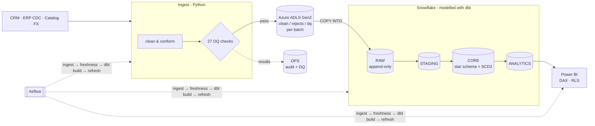

# Customer & Revenue Intelligence Platform

[](https://github.com/Akashchandra-30/customer-revenue-intelligence-platform/actions/workflows/ci.yml)


A production-style customer and revenue analytics platform. It ingests transactional and customer data from several source systems, and validates and quarantines it with **Python (Pandas/NumPy)**. The data is staged in an **Azure** data lake, loaded into **Snowflake**, and modelled with **dbt** into a tested star schema. Advanced **SQL** calculates revenue trends, customer lifetime value, retention and RFM segmentation, and **Power BI** dashboards with **DAX** measures and row-level security serve the results. The pipeline is orchestrated with **Airflow**, deployed with **Bicep** and **Docker**, and tested in **CI/CD**.

**Stack:** SQL · Python · dbt · Snowflake · Azure (ADLS Gen2, Key Vault, Container Apps) · Airflow · Power BI · Docker · GitHub Actions

---

## Architecture



Design decisions are recorded as ADRs in [`docs/architecture.md`](docs/architecture.md). On-call procedures are in [`docs/runbook.md`](docs/runbook.md).

## What makes it production-grade

| Area | Implementation |
|---|---|
| **Idempotent, incremental loads** | Append-only RAW with `_batch_id` / `_loaded_at`. A batch is replaced when re-run, so retries are safe. The facts are dbt `incremental` models on the CDC timestamp, with a lookback window for late-arriving refunds. |
| **History** | SCD Type 2 customer dimension from a dbt snapshot, so segment changes don't rewrite past revenue. The data lake keeps every batch for replay and audit. |
| **Data quality** | A Python gate blocks bad loads, and quarantined rows are kept with a reason. dbt adds 61 data tests, 2 unit tests, 3 reconciliation tests and source freshness SLAs. Results are persisted to `ops.dq_results`. |
| **Observability** | `ops.pipeline_runs` audit table, JSON logs with a `run_id` that correlates Airflow, logs, the lake and the warehouse, and Slack/Teams failure alerts. |
| **Security** | Key Vault plus a managed identity (no storage keys), a Snowflake key-pair service user, least-privilege roles, dynamic email masking and Power BI row-level security. |
| **Cost control** | Snowflake resource monitor, auto-suspend warehouse, clustering on large facts, and lake lifecycle tiering (cool → archive → 7-year delete). |
| **Environments** | `local` (DuckDB), `dev` (per-developer Snowflake schemas, SSO) and `prod` (service user). The same dbt models run everywhere through cross-database macros. |
| **CI/CD** | Lint (ruff), types (mypy), unit and end-to-end tests, `dbt build`, Airflow DAG integrity check, and a Docker build with a smoke test. The deploy workflow pushes the image to ACR and runs `dbt build` in prod behind an approval gate. |

## SQL analytics (dbt + Snowflake)

| Model | Metrics | SQL techniques |
|---|---|---|
| [`monthly_revenue`](dbt/models/marts/analytics/monthly_revenue.sql) | Revenue, orders, new vs returning customers, AOV, MoM %, YoY %, rolling 3-month, YTD, cumulative | dense month spine, `LAG`, `LAG(…,12)`, windowed `SUM … ROWS BETWEEN` |
| [`customer_ltv`](dbt/models/marts/analytics/customer_ltv.sql) | Historical LTV, AOV, tenure, frequency, **predicted margin CLV**, lifecycle status, rank in segment, Pareto share | `DATEDIFF`, `RANK`, `PERCENT_RANK`, running totals, `SUM() OVER ()` |
| [`cohort_retention`](dbt/models/marts/analytics/cohort_retention.sql) | Retention by first-purchase cohort × months since first order, cumulative revenue per customer | cohort CTEs, `COUNT(DISTINCT)`, windowed running totals |
| [`retention_90d`](dbt/models/marts/analytics/retention_90d.sql) | Rolling 90-day retention and churn | range joins with `DATEADD` |
| [`rfm_segments`](dbt/models/marts/analytics/rfm_segments.sql) | Recency/Frequency/Monetary scores → Champions, Loyal, At Risk… | `NTILE(5)` |
| [`revenue_by_segment`](dbt/models/marts/analytics/revenue_by_segment.sql) / [`revenue_by_category`](dbt/models/marts/analytics/revenue_by_category.sql) | Share of month, category rank and growth | `SUM(SUM(x)) OVER (PARTITION BY …)`, `DENSE_RANK` |
| [`fct_orders`](dbt/models/marts/core/fct_orders.sql) | USD conversion, gross vs net revenue, discounts | incremental `delete+insert`, CDC lookback |
| [`stg_erp__orders`](dbt/models/staging/stg_erp__orders.sql) | Latest CDC version of each order | `QUALIFY ROW_NUMBER()` |

## Results on the sample dataset

The default run uses 5,000 customers, ~26k orders and ~48k order lines from Jan 2023 to Aug 2026, generated with realistic defects: duplicates, mixed date formats, orphan keys, CDC re-deliveries and invalid quantities.

| KPI | Value |
|---|---|
| Net revenue | **$143.9M** (2024 → 2025: +74%) |
| Paying customers | 4,842 |
| Avg order value | $6,463 |
| Avg historical customer LTV | $29,726 |
| Repeat purchase rate | 73.6% |
| Revenue from top 10% of customers | 67.0% |
| Cohort retention, month 1 / 3 / 6 / 12 | 29.1% / 22.5% / 19.1% / 13.2% |
| Avg rolling 90-day retention | 53.5% |
| RFM "Champions" | 822 customers = $86.2M (60% of revenue) |

**Data quality per batch:** 27/27 gate checks and 85/85 dbt nodes pass. 21 customers, 325 orders and 738 order lines are quarantined with reasons, and 582 duplicate records are collapsed.

## Quick start (local, no cloud accounts needed)

```bash
pip install -e ".[dev]"
revintel run --target local --generate      # ingest → dbt build → export for Power BI
pytest                                      # unit + end-to-end (runs dbt twice, checks SCD2 and idempotency)
make dbt-docs                               # lineage graph and model docs at localhost:8080
```

Outputs: a DuckDB warehouse at `output/revintel.duckdb`, the data lake in `data/lake/`, and Power BI-ready CSVs in `output/powerbi/`.

**CLI**

```bash
revintel ingest    --target prod --upload-azure --load-mode stage   # Python → ADLS → COPY INTO RAW
revintel transform --target prod [--full-refresh] [--select +customer_ltv]
revintel publish   --target prod                                     # Power BI dataset refresh
revintel run       --target local --generate                         # all stages
```

Or with Docker: `docker build -t revintel . && docker run --rm revintel`.

## Deploying to Azure + Snowflake

1. **Infrastructure:** `az deployment group create -g rg-revintel-prod -f infra/azure/main.bicep -p infra/azure/main.bicepparam` creates the ADLS Gen2 lake, Key Vault, managed identity, Log Analytics and a scheduled Container Apps job.
2. **Snowflake:** run [`sql/00_setup.sql`](sql/00_setup.sql) as an admin. It creates the warehouse, resource monitor, schemas, roles, key-pair service user, masking policy and Azure stage.
3. **Secrets:** add `snowflake-private-key`, `powerbi-client-secret` and `alert-webhook-url` to Key Vault.
4. **Orchestration:** deploy [`orchestration/airflow/dags/revintel_daily.py`](orchestration/airflow/dags/revintel_daily.py) to Airflow (image: this repo's Dockerfile), or rely on the Container Apps schedule.
5. **CD:** set `DEPLOY_ENABLED=true`, `ACR_NAME` and the OIDC and Snowflake secrets for [`deploy.yml`](.github/workflows/deploy.yml).
6. **Power BI:** follow [`powerbi/DASHBOARD_GUIDE.md`](powerbi/DASHBOARD_GUIDE.md). It covers the star-schema model, [`measures.dax`](powerbi/measures.dax) (~30 measures), [`rls_roles.dax`](powerbi/rls_roles.dax), four report pages and deployment pipelines.

## Project structure

```
├── revintel/                    # Python package + `revintel` CLI
│   ├── generate_data.py         # synthetic multi-source extracts with injected defects
│   ├── extract.py / transform.py / validate.py   # read → clean/quarantine → DQ gate
│   ├── warehouse.py             # DuckDB & Snowflake adapters, idempotent batch loads, audit
│   ├── azure_storage.py         # ADLS upload (managed identity, retries)
│   ├── dbt_runner.py            # programmatic dbt invocation
│   ├── powerbi.py               # dataset refresh via REST API
│   ├── pipeline.py / cli.py     # stages with audit tracking; CLI entry point
│   └── config.py / observability.py              # typed settings; JSON logs + alerts
├── dbt/
│   ├── models/staging/          # dedupe + type (views), sources with freshness SLAs
│   ├── models/intermediate/     # currency conversion
│   ├── models/marts/core/       # incremental facts, dims, SCD2 history, date dim
│   ├── models/marts/analytics/  # revenue, CLV, cohorts, retention, RFM, KPIs
│   ├── snapshots/ seeds/ tests/ macros/          # SCD2, RLS mapping, reconciliation tests
│   └── models/exposures.yml     # Power BI dashboard lineage
├── sql/                         # Snowflake platform setup, RAW DDL, ops queries
├── orchestration/airflow/dags/  # daily DAG
├── infra/azure/                 # Bicep: ADLS, Key Vault, identity, Container Apps job
├── powerbi/                     # DAX measures, RLS, Power Query, theme, dashboard guide
├── docs/                        # architecture + ADRs, runbook
├── tests/                       # unit, warehouse, CLI, end-to-end, DAG integrity
├── Dockerfile · Makefile · pyproject.toml · .pre-commit-config.yaml
└── .github/workflows/           # CI (lint, test, dbt, airflow, docker) and CD
```
