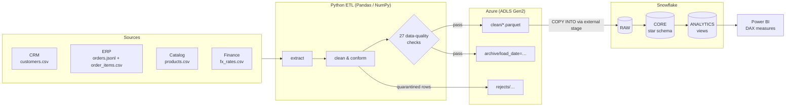

# Customer & Revenue Intelligence Platform

An end-to-end customer and revenue analytics platform. It pulls transactional and customer data from several source systems, cleans and validates it with **Python (Pandas/NumPy)**, stages it in **Azure** Data Lake Storage, and models it in **Snowflake**. Advanced **SQL** calculates revenue trends, customer lifetime value, retention and segmentation, and **Power BI** dashboards built with **DAX** present the results to business stakeholders.

**Stack:** SQL · Python · Azure · Snowflake · Power BI

---

## Architecture



| Layer | What happens | Where |
|---|---|---|
| **Sources** | 4 systems with realistic problems: duplicates, mixed date formats, casing/whitespace noise, orphan keys, invalid quantities, CDC re-deliveries | [`revintel/generate_data.py`](revintel/generate_data.py) |
| **Clean & validate** | Standardise, type, deduplicate (latest version wins), quarantine bad rows with a reason, reconcile raw = clean + rejected + deduplicated, block the load if any error-level check fails | [`transform.py`](revintel/transform.py), [`validate.py`](revintel/validate.py) |
| **Azure** | Parquet snapshots in `clean/`, immutable daily `archive/`, `rejects/` for data stewards; lifecycle tiering; scheduled Container Apps job | [`azure_storage.py`](revintel/azure_storage.py), [`infra/azure/main.bicep`](infra/azure/main.bicep) |
| **Snowflake** | Warehouse, roles, storage integration, external stage → `RAW` → `CORE` star schema → `ANALYTICS` metric views | [`sql/`](sql) |
| **Power BI** | Star-schema model, ~30 DAX measures (time intelligence, retention, CLV), 4-page report spec, theme | [`powerbi/`](powerbi) |

## SQL analytics (Snowflake)

All metric logic lives in [`sql/04_analytics_views.sql`](sql/04_analytics_views.sql):

| View | Metrics | Techniques |
|---|---|---|
| `monthly_revenue` | Revenue, orders, new vs returning customers, AOV, MoM %, YoY %, rolling 3-month, YTD, cumulative | `LAG`, `LAG(…,12)`, windowed `SUM … ROWS BETWEEN`, `PARTITION BY YEAR()` |
| `customer_ltv` | Historical LTV, AOV, tenure, purchase frequency, **predicted 24-month CLV**, lifecycle status, rank in segment, percentile, cumulative revenue share (Pareto) | multi-CTE, `DATEDIFF`, `RANK`, `PERCENT_RANK`, running `SUM` / `SUM() OVER ()` |
| `cohort_retention` | Retention by first-purchase cohort × months since first order, cumulative revenue per customer | cohort CTEs, `COUNT(DISTINCT)`, windowed running totals |
| `retention_90d` | Rolling 90-day retention and churn rate per month | range self-joins with `DATEADD` |
| `rfm_segments` | Recency/Frequency/Monetary quintiles → Champions, Loyal, At Risk, Hibernating… | `NTILE(5)` |
| `revenue_by_segment` / `revenue_by_category` | Revenue by segment, country, channel, category; share of month; category rank and growth | `SUM(SUM(x)) OVER (PARTITION BY …)`, `DENSE_RANK` |
| `kpi_summary` | Headline KPI row for dashboard cards | aggregate over views |

The `CORE` layer ([`03_core_models.sql`](sql/03_core_models.sql)) converts local currencies to USD, applies discounts, separates gross vs net revenue and adds each customer's order sequence with `ROW_NUMBER()`.

**The SQL is tested without a Snowflake account.** The local runner transpiles the Snowflake SQL to DuckDB with [sqlglot](https://github.com/tobymao/sqlglot) and runs it as-is. The end-to-end tests check that SQL revenue reconciles with an independent Pandas calculation.

## Results on the sample dataset

The default run uses 5,000 customers, ~26k orders and ~48k order lines from Jan 2023 to Aug 2026:

| KPI | Value |
|---|---|
| Net revenue | **$143.9M** (2024 → 2025: +74%) |
| Paying customers | 4,842 |
| Avg order value | $6,463 |
| Avg historical customer LTV | $29,726 |
| Repeat purchase rate | 73.6% |
| Revenue from top 10% of customers | 67.0% |
| Cohort retention, month 1 / 3 / 6 / 12 | 29.1% / 22.5% / 19.1% / 13.2% |
| RFM "Champions" | 822 customers = $86.2M (60% of revenue) |

**Data quality:** 27/27 checks pass. 21 customers were quarantined (invalid emails). 325 orders were quarantined: 175 orphan customers, 90 missing timestamps and 60 orders with no valid lines. 738 order lines were quarantined, and 582 duplicate records were collapsed. The full report is at `output/data_quality_report.json`.

## Quick start (local, no cloud accounts needed)

```bash
pip install -r requirements.txt
python -m revintel.pipeline --target local --generate
pytest
```

This generates the source extracts, cleans and validates them, and builds a DuckDB warehouse at `output/revintel.duckdb` from the Snowflake SQL. It also exports every core table and analytics view to `output/powerbi/*.csv`, so you can build the Power BI report offline.

## Running on Azure + Snowflake

1. **Azure:** deploy storage (and optionally the scheduled job):
   ```bash
   az group create -n rg-revintel -l westeurope
   az deployment group create -g rg-revintel -f infra/azure/main.bicep
   ```
2. **Snowflake:** fill in `<tenant-id>` / `<storage-account>` in [`sql/00_setup.sql`](sql/00_setup.sql), run it as an admin, then complete the Azure consent step described in the file.
3. **Configure:** `cp .env.example .env` and fill in the credentials.
4. **Run:**
   ```bash
   # Upload to ADLS, then COPY INTO Snowflake from the external stage
   python -m revintel.pipeline --target snowflake --upload-azure --via-azure-stage

   # or load directly with write_pandas
   python -m revintel.pipeline --target snowflake
   ```
5. **Power BI:** connect with [`powerbi/snowflake_source.pq`](powerbi/snowflake_source.pq), add the measures from [`powerbi/measures.dax`](powerbi/measures.dax), and follow [`powerbi/DASHBOARD_GUIDE.md`](powerbi/DASHBOARD_GUIDE.md).

## Power BI dashboards

| Page | Highlights |
|---|---|
| Executive Overview | Revenue, YoY %, active customers, AOV, LTV cards; revenue with rolling-3M trend; MoM growth |
| Revenue Performance | Revenue by category, segment, country and channel; YTD waterfall |
| Customer Segments & CLV | RFM segment mix, frequency × monetary scatter, top customers, CLV by acquisition channel |
| Retention & Churn | Cohort retention heatmap, 90-day retention/churn trend, lifecycle mix, new vs returning |

Key DAX: `Revenue YoY %` (`SAMEPERIODLASTYEAR`), `Revenue Rolling 3M` (`DATESINPERIOD`), `Revenue YTD` (`TOTALYTD`), `Customer Retention Rate MoM` (`INTERSECT` of current and prior-month buyers), `Revenue Share %` (`ALLSELECTED`), `Cohort Retention %`.

## Project structure

```
├── revintel/
│   ├── generate_data.py     # synthetic multi-source extracts with injected quality issues
│   ├── extract.py           # read CRM / ERP / catalog / finance files
│   ├── transform.py         # Pandas + NumPy cleaning, dedup, quarantine
│   ├── validate.py          # data-quality gate + reconciliation
│   ├── azure_storage.py     # upload clean / archive / rejects layers to ADLS
│   ├── snowflake_loader.py  # write_pandas or COPY INTO, then build models
│   ├── local_warehouse.py   # DuckDB runner for the Snowflake SQL (sqlglot)
│   └── pipeline.py          # CLI orchestrator
├── sql/                     # 00 setup · 01 raw DDL · 02 Azure COPY · 03 core · 04 analytics
├── powerbi/                 # DAX measures, Power Query source, theme, dashboard guide
├── infra/azure/main.bicep   # ADLS Gen2 + lifecycle + scheduled Container Apps job
├── tests/                   # unit + end-to-end tests
├── Dockerfile
└── .github/workflows/ci.yml
```
