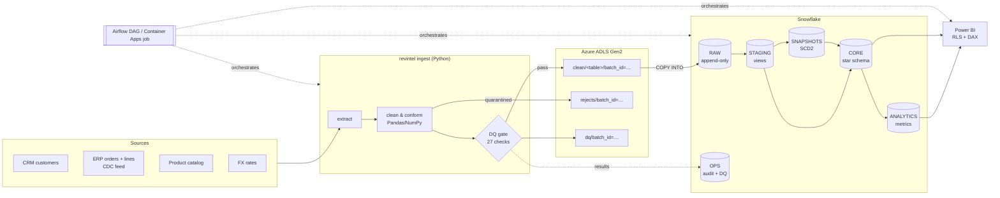

# Architecture & Design Decisions

## Data flow

| Environment | Warehouse | dbt target | Auth | Used by |
|---|---|---|---|---|
| `local` | DuckDB file | `local` | none | developers, CI, Docker smoke test |
| `dev` | Snowflake `DEV_<USER>_*` schemas | `dev` | SSO (`externalbrowser`) | developers |
| `prod` | Snowflake `RAW/STAGING/CORE/ANALYTICS` | `prod` | RSA key-pair from Key Vault | Airflow / Container Apps job, deploy workflow |

## Architecture decision records

### ADR-001 - ELT with dbt, Python only for ingestion
**Context:** Transformation logic started as hand-run SQL scripts with no tests, lineage or dependency order.
**Decision:** Python keeps what it is best at: parsing messy files, record-level validation and quarantine. All modelling moves to dbt, which runs in the warehouse.
**Consequences:** SQL is version-controlled, tested (~60 data tests plus unit tests), documented, and has lineage. Analysts can contribute models without touching Python.

### ADR-002 - Append-only RAW with batch metadata
**Context:** Truncate-and-reload loses history and is unsafe if a load fails halfway.
**Decision:** Every load is a batch (`_batch_id`, `_loaded_at`). A batch is deleted before it is (re)inserted, so retries are idempotent. Staging models deduplicate with `QUALIFY ROW_NUMBER()`, keeping the latest version of each business key.
**Consequences:** Re-running any stage is safe. RAW grows, so it keeps 90 days (see `sql/02_ops_monitoring.sql`), while the data lake keeps the full, immutable history for replay.

### ADR-003 - Incremental facts keyed on the CDC timestamp
**Decision:** `fct_orders` and `fct_order_items` are `delete+insert` incremental models filtered on `ingested_at`, with a configurable lookback (`incremental_lookback_days`). This picks up late-arriving status changes such as refunds.
**Consequences:** Daily runs process days of data, not years. Window functions that need a customer's full history (first purchase, cohorts) live in non-incremental models (`dim_customer`, analytics marts). `--full-refresh` rebuilds from scratch.

### ADR-004 - SCD Type 2 for customers
**Decision:** A dbt snapshot (`timestamp` strategy on the CRM `updated_at`) tracks segment, country and channel changes. `dim_customer` holds current attributes and `dim_customer_history` holds every version.
**Consequences:** Revenue can be attributed to the segment a customer had *at the time of purchase*, and reclassifications no longer rewrite history.

### ADR-005 - Same SQL locally and in production
**Decision:** dbt cross-database macros (`dbt.datediff`, `dbt.dateadd`, `dbt.date_trunc`) keep models portable between Snowflake and DuckDB.
**Consequences:** CI runs the real models and tests on every pull request in about a minute, at no warehouse cost. Snowflake-only features (masking policies, clustering) are behind `target.type` checks.

### ADR-006 - Data-quality gate before the warehouse
**Decision:** The Python gate blocks a load if error-level checks fail (uniqueness, not-null, referential integrity, accepted values, row reconciliation). Bad records are quarantined with a reason instead of being silently dropped. dbt tests then guard the modelled layers.
**Consequences:** Two layers of defence. Every check result is stored in `ops.dq_results` for trend monitoring and audit.

### ADR-007 - Security by default
- **Secrets:** stored in Key Vault only, and read through a managed identity. Storage accounts don't allow shared keys.
- **Snowflake:** a service user with key-pair authentication and no password. Separate least-privilege roles for loading, transforming and reporting. A resource monitor caps monthly credits.
- **PII:** a dynamic masking policy on email, applied by a dbt post-hook.
- **Power BI:** dynamic row-level security driven by a version-controlled seed.

## Data model

| Layer | Object | Grain | Materialization |
|---|---|---|---|
| staging | `stg_crm__customers`, `stg_erp__orders`, `stg_erp__order_items`, `stg_catalog__products`, `stg_finance__fx_rates` | one current row per business key | view |
| intermediate | `int_order_items__converted` | order line, USD-converted | view |
| snapshots | `snap_customers` | customer version | snapshot (SCD2) |
| core | `fct_orders`, `fct_order_items` | order / order line | incremental |
| core | `dim_customer`, `dim_customer_history`, `dim_product`, `dim_date`, `security_country_access` | entity / version / day | table / seed |
| analytics | `monthly_revenue`, `customer_ltv`, `cohort_retention`, `retention_90d`, `rfm_segments`, `revenue_by_segment`, `revenue_by_category`, `kpi_summary` | metric-specific | table |

Full column-level documentation and lineage: `make dbt-docs`, or the `pipeline-output` artifact of any CI run.
